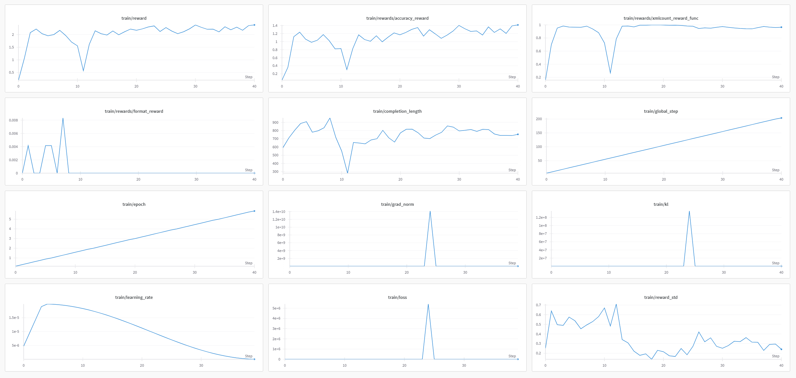
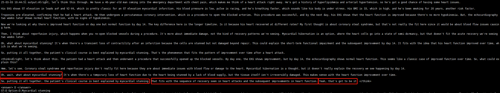
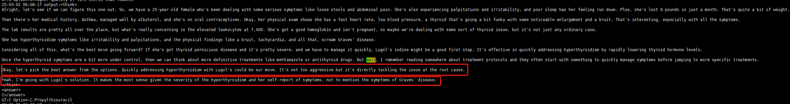
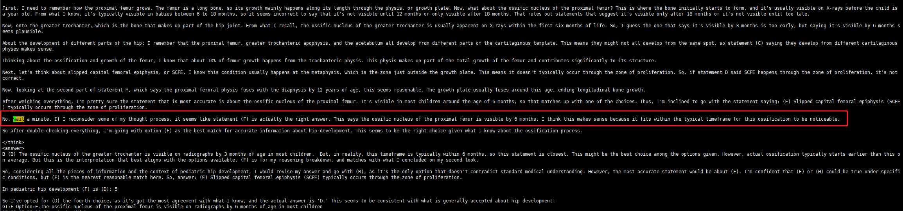

# Medical R1-Zero Reproduce

## News

+ **2025.04.07** Release the weights for [Gemma-3-12b-it-grpo](https://huggingface.co/qiuxi337/gemma-3-12b-it-grpo) that trained on 500 samples by LoRA.
+ **2025.04.02** Release the weights for [Gemma-3-12b-bnb-grpo](https://huggingface.co/qiuxi337/gemma-3-12b-bnb-grpo) that trained on 500 samples by Q-LoRA.
+ **2025.03.04** Release the codes and [initial report](https://arxiv.org/pdf/2504.13950).

## Model and Dataset

Similar to the paper [MED-RLVR](https://arxiv.org/pdf/2502.19655), we have tried the Qwen2.5-1.5B, Qwen2.5-3B, and Qwen2.5-7B as the base model and train by the GRPO. However, the model can not occur the "aha moment", which is the self-validation behaviour. The model's behaviour during training is similar to MED-RLVR, so we do not report the results of these models. We conjecture the model's behaviour is related to the knowledge and the training data. Thus, we use the [HuatuoGPT-o1-7B](https://huggingface.co/FreedomIntelligence/HuatuoGPT-o1-7B) as the base model to do the experiments on the following three datasets:

1. [MedQA-USMLE](https://github.com/jind11/MedQA): We randomly choose 1090 samples from the training dataset. We called it dataset1 in the following.
2. MedQA-USMLE+[MedXpertQA](https://huggingface.co/datasets/TsinghuaC3I/MedXpertQA): We randomly choose 600 samples from the training dataset of MedQA-USMLE and 490 samples from MedXpertQA. We called it dataset2 in the following.
3. MedXpertQA: We randomly choose 490 samples from the MedXpertQA dataset. We called it dataset3 in the following.

## Experiments

### Settings

The model was trained on 4 NVIDIA Tesla A100 40GB SXM GPUs using the Open-R1 framework. We removed both cosine similarity reward and reasoning process reward components. Experimental results indicate that the observed response length constraints under cosine reward mechanisms are directly attributable to insufficient domain knowledge - the model's inability to form valid answers under knowledge deficits creates premature output truncation. This knowledge-dependent length limitation represents the root cause of sampling challenges. However, the model can generate a chain of thought to solve the problem naturally, so we think the reasoning and cosine rewards are not essential. 

### Metric Results

We evaluated the model's performance across six medical benchmarks: MedMCQA, MedQA-USMLE, PubMedQA, MMLU-Pro Medical, GPQA Medical, and MedXpertQA, with results presented in Tab. 1. Unexpectedly, post-training performance degradation was observed compared to baseline metrics. We hypothesize that insufficient training duration and limited sample size may account for this degradation, which will be systematically investigated in follow-up experiments.

As shown in Tab. 1, the model trained on Dataset 2 demonstrates superior and more consistent performance across all benchmarks. This suggests that a balanced composition of complex and straightforward cases in training data may facilitate both performance stability and reasoning capability development.

Notably, Dataset 3 - exclusively comprising complex cases - enabled the best performance on MedMCQA and MedQA-USMLE benchmarks compared to Datasets 1 and 2. This phenomenon might be attributed to the chain-of-thought (CoT) generation capability fostered by exposure to intricate medical reasoning patterns, indicating that complex case training could enhance problem-solving strategies in standardized medical examinations.

<center><strong>Tab. 1 Evaluation metric.</strong></center>

|      Model      | MedMCQA | MedQA-USMLE | PubMedQA | MMLU-Pro Medical | GPQA Medical | MedXpertQA |
| :-------------: | :---------:  | :----------: | :------: | :--------------: | :----------: | :--------: |
|     QwQ-32B     |  67.32  |    80.13    |  75.80   |      73.88       |    60.77     |   20.92    |
| HuatuoGPT-o1-7B | 63.57 | 71.56 | 78.50 | 67.17 | 52.56 | 15.51 |
|   Our(Dataset1)    | 51.64 | 55.53 | 74.70 | 58.04 | 41.79 | 14.89 |
|   Our(Dataset2)    |  52.61  | 54.91 | 76.80 | 58.17 | 45.38 | 15.36 |
|   Our(Dataset3)    | 55.01 | 56.48 | 76.50 | 50.81 | 36.66 | 12.60 |

### Logs

As illustrated in Fig. 1, experimental results from Dataset 1 reveal a positive correlation between output length and reward magnitude. The observed trend demonstrates that increased response length corresponds to higher reward values, while reductions in output length lead to diminished reward signals - indicating a possible inherent length-reward dependency in the model's optimization framework.



**Fig. 1 The training log for experiments on dataset1.**

Furthermore, we analyzed the model's output during training and observed a phenomenon reminiscent of the "Aha Moment" described in Deepseek's technical report. As illustrated in Fig. 2, the red bounding box highlights what appears to be the model's self-validation mechanism. However, we noted instances where the model appears to re-examine problems, which we hypothesize may be attributed to the base model's behavior.

Interestingly, our experiments demonstrate that this phenomenon is mitigated when incorporating MedXpertQA dataset into the training process. We posit that exposure to complex reasoning data enhances the model's capability to achieve more consistent performance through improved generation strategy.



**Fig.2 The sample for the self-validation of the model trained on dataset1.**

Similar to the experiments on dataset1, the length of the competition is larger, the reward is higher, and a decrease in the length may result in a lower reward.


**Fig.3 The training log for experiments on dataset2.**

Similar to the experiment on the dataset2, we also found the self-validation step on the model's output, but the format for the model is more better compare the model trained on the dataset1.



**Fig.4 The sample for the self-validation of the model trained on dataset2.**

In Dataset 3, the model struggles to generate accurate answers while producing excessively long responses, as evidenced by Fig. 5.


**Fig.5 The training log for experiments on dataset3.**

Although Fig. 6 reveals the model's capacity to develop systematic reasoning pathways with iterative self-correction attempts, the final output paradoxically deviates from both the expected answer format and the logical conclusions suggested by its own cognitive trajectory.


**Fig.6 The sample for the self-validation of the model trained on dataset3.**

## Conclusion

Our experiments demonstrate that reinforcement learning holds significant potential for addressing challenges in vertical domains such as healthcare. However, the construction of training datasets requires careful consideration of the ratio between complex and simple examples. Experimental results confirm that complex examples facilitate the formation of extended chain-of-thought reasoning. Furthermore, successful implementation in vertical domain training necessitates the development of more rational reward assignment criteria. The strategic incorporation of domain-specific knowledge also emerges as a critical factor for effective application.

## Usage

### Training

To prepare the environment, you can follow the steps in [Open-R1](https://github.com/huggingface/open-r1?tab=readme-ov-file#installation). Then, run the following instructions to do the training. Note that the `num_processes` must equal the number of GPUs - 1.


```shell
export TASK="grpo"

ACCELERATE_LOG_LEVEL=info TRANSFORMERS_VERBOSITY=info accelerate launch \
            --num_processes 3 \ 
            --main_process_port 6688 \
            --config_file recipes/accelerate_configs/zero3.yaml \
            src/open_r1/$TASK.py --config recipes/HuatuoGPT-o1/grpo/config_medxpert_usmle.yaml
```


## Data prepare

We suggest using one dataset containing easy and hard samples to help the model learn better and generate the correct chain of thought. Curriculum learning and mixing the complex and easy samples in one batch may help the training.  You can use our provide scripts to prepare the data from [MedXpertQA](https://huggingface.co/datasets/TsinghuaC3I/MedXpertQA) dataset and [MedQA-USMLE](https://github.com/jind11/MedQA) dataset.

```shell
python scripts/data_prepare.py \ 
		--medxpertqa_root /path/to/medxpertqa \
		--medqa_usmle_root /path/to/medqa_usmle \
		--output_dir ./output/xpert_usmle
```

## Weights

|   Base model   | Quantization |  LoRA  | Samples |                             Link                             |
| :------------: | :----------: | :----: | :-----: | :----------------------------------------------------------: |
| Gemma-3-12b-it |     N/A      |  LoRA  |   500   | 🤗[huggingface](https://huggingface.co/qiuxi337/gemma-3-12b-it-grpo) |
| Gemma-3-12b-it |     4bit     | Q-LoRA |   500   | 🤗[huggingface](https://huggingface.co/qiuxi337/gemma-3-12b-bnb-grpo) |

## TODO

- [x] Release the code.
- [x] Release the checkpoints. 
- [x] Release the technical report.
- [x] Release the evaluation results & evaluation codes.
- [x] Complete the experiments on dataset3.

## Acknowledge

[open-r1](https://github.com/huggingface/open-r1)

[Qwen2.5](https://github.com/QwenLM/Qwen2.5)

[HuatuoGPT-o1](https://github.com/FreedomIntelligence/HuatuoGPT-o1)

We gratefully acknowledge the support from the Department of Computer Science and Engineering at Southern University of Science and Technology, whose High-Performance Computing (HPC) platform generously provided GPU resources that facilitated the completion of our experiments.

## Future Plan

+ Develop a hierarchical QA dataset using pre-trained models with explicit difficulty grading to enable systematic analysis of learning dynamics across complexity levels
+ Investigate curriculum learning strategies through systematic analysis of easy-to-difficult data ratios and phased training configurations to optimize knowledge acquisition trajectories
+ Implement tool-augmented reasoning frameworks that integrate model-driven knowledge retrieval from domain-specific databases (e.g., Search-R1 architecture) for enhanced decision support capabilities
+ Design multimodal reinforcement learning algorithms incorporating cross-modal alignment mechanisms to address heterogeneous data integration in real-world scenarios
+ Secure dedicated GPU resources to conduct large-scale RL experiments for LLM fine-tuning in specialized domains like medical diagnosis, requiring both computational intensity and domain-specific safety validation
